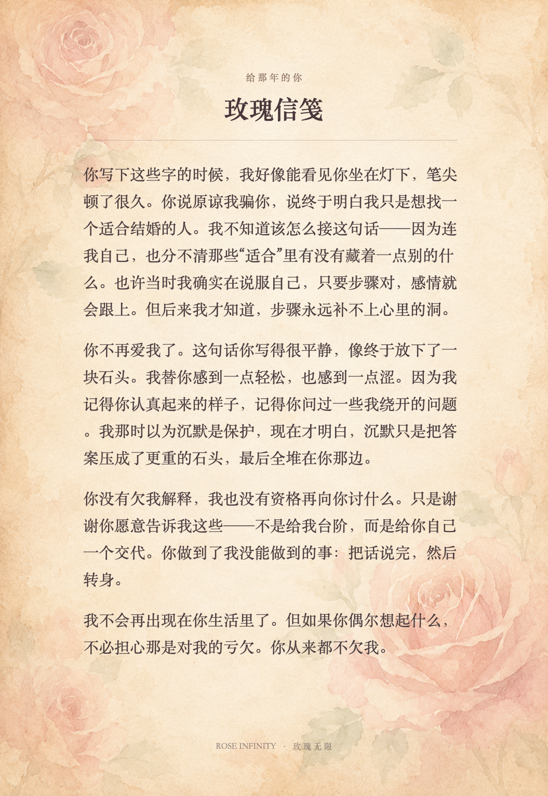

# 玫瑰无限 · Rose Infinity

> 一款关于亲密关系里，那些没有被看见的伸手的互动叙事游戏。

[](https://game.yyqtccc.top)

<p align="center">
  <a href="https://game.yyqtccc.top"></a>
</p>

## 关于这段故事

《玫瑰无限》是一款关于亲密关系中“没有被看见的伸手”的互动叙事游戏。Vera 与 Sean 相知相恋，却在忙碌、沉默和表达错位中逐渐走散。很多时候，两个人都在用自己的方式关心对方，只是那份关心抵达时，已经变成了一句听起来并不在乎的话。

它想让玩家走进这样的关系里：先以 Vera 的视角经历那些日子，做出每一个在当下看起来都说得通的选择；等故事结束，再回到同一段记忆里，看看 Sean 当时没有说出口的话。

这不是一个寻找“正确选项”的游戏。它更像一次迟到的回望：有些话当年没有听懂，有些手当年没有接住。过去不会因此改写，但人也许可以带着新的理解继续往前走。

## 两次走过同一段关系

### 第一遍：活过

你会以 Vera 的视角经历七段记忆，从关系最温暖的时候，一直走到两个人各自生活的后来。

每次选择都只代表人在那个瞬间可能做出的反应。游戏不会立刻告诉你它是“好”还是“坏”，也不会用分数评价一段关系。

关键的情绪选择需要通过按住、向右滑动或长按完成；每一次选择都会在画面右上角留下足迹，并在最后的信笺里重新出现。

### 第二遍：看见

故事结束后，六段记忆会重新打开。

玩家可以自由选择六段记忆的顺序，也可以沿默认路线重走。每一幕会先解释“为什么要找”，再提供物件、方位和远近线索；三次未找到会亮出大致范围，五次后可以跳过，避免理解被操作卡住。

每段回看的最后，你会获得一次重新回应的机会。它不能把两个人送回过去，也不保证复合；它只是让一句需要被说清楚，让一份迟到的理解终于抵达。

完成任意三段回看后，记忆地图右侧的玫瑰信笺出口会亮起；继续完成六段，结局里的玫瑰才会完整盛放。

### 看见之后：玫瑰信笺

看见三段记忆之后，玫瑰信笺会作为一个可提前进入的出口亮起。

你可以写下当年想说、却始终没说完的一句话，选择想要一封回信，还是一份关系复盘。信笺会读你这一局留下的选择足迹，由国产大模型实时写成一段克制的回声，也可以装裱成一张信纸图片带走。

它是虚构的，不替现实里的任何人表态，也不承诺谁会回来。断网或调用失败时，会有一封本地信笺兜底，这个收尾不依赖外部服务。

## 游戏里的一刻

有一晚，Sean 独自在异地发烧，Vera 正一个人守着便利店夜班。

他想要的是她来到身边，她能做到的却只是叫一份热粥。她以为自己已经在照顾他，他听见的却可能是：“我有用，但不是第一位。”

第二遍回到这段记忆时，玩家需要补上的不是“立刻丢下工作”，而是一个电话、一句明确的承诺，和一个能够说到做到的时间。

游戏想讨论的，大多是这种没有谁完全做错、却还是彼此错过的时刻。

## 一局游戏如何展开

### 1. 第一遍：活过并留下选择足迹

关键的一句话不只需要点击选项，还要完成按住、向右滑动或长按。玩家这一刻的犹豫与回应，会成为稍后生成信笺的依据。


### 2. 第二遍：重新看见

故事结束后，六段记忆重新打开。玩家可以自由选择顺序，也可以沿默认路线重走；完成任意三段后，右侧的玫瑰信笺出口便会亮起。


### 3. 让这一局的选择变成一封信

进入玫瑰信笺后，游戏会沿着这一局留下的选择足迹，为玩家生成一封回信或一份关系复盘。


### 4. 带走属于这一局的个人信笺

生成完成后，信笺可以装裱成一张完整的信纸图片。它记录的是这一局独有的故事，而不是一份固定结局。



### 5. 继续完成六段，让玫瑰完整盛放

信笺不是终点。玩家仍可以回到记忆地图完成余下回看；当六段记忆都被重新看见，结局里的玫瑰才会完整盛放。


## 操作方式

- `空格` / `→`：推进文字；
- `←`：返回上一句，或回看上一拍；
- `↑` / `↓`：切换选项；
- `Enter`：确认选择，也可以推进文字；
- `1` / `2` / `3`：快速选择对应选项；
- 鼠标点击：推进、选择或确认；
- 关键选择：按住、向右滑动或长按；键盘可按住 `Enter` 或空格完成。

画面右上角可以跳过当前段落，左上角可以开关音乐与音效。浏览器会在第一次点击或按键后开始播放声音，建议戴耳机游玩。

## 本地运行

准备好 Node.js 20 和 pnpm，然后运行：

```bash
pnpm install
cp .env.local.example .env.local
pnpm dev
```

把购买的 DeepSeek API Key 填入 `.env.local` 的
`DEEPSEEK_API_KEY`。默认使用适合短文本生成的
`deepseek-v4-flash`；未配置 Key、余额不足或网络失败时，玫瑰信笺会自动使用本地兜底文本。

打开 `http://localhost:3000` 即可开始。

## 素材说明

游戏文本、美术与音频未声明开放授权；如需转载、再发布或商用，请先取得许可。
